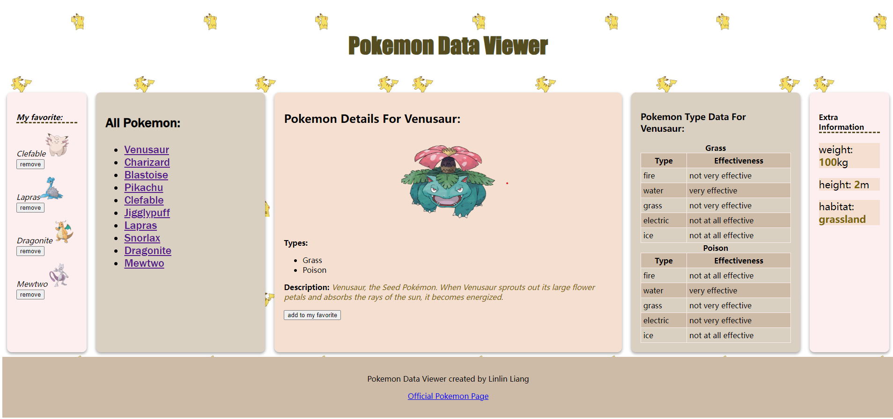

Pokemon Data Viewer
==========

Introduction
-----------
This single page will allow a user to view data about all Pokemon and Pokemon types. As the user selects options on the page, the data will be loaded dynamically from the server with fetch requests and displayed on the page through client-side JavaScript code. 

Tech stack
-----------
AJAX - dynamically load new data into an already loaded page. 

Html

Javascript

CSS

Node.js

Express.js

Structure of project and data
---------------------

In the project directory, there is a file named `web-assignment-pokemon.js`. This file has the data for functions that will allow you to access this data in your route handler code and the basic code for the server. 

All of the server-side code for the project is inside `web-assignment-pokemon.js`. Server-side code for this project will mainly be route handlers that send JSON data as a response to fetch requests. 

In the `public` directory, there is a `public/index.html` along with an associated JavaScript (`public/scripts/script.js`) and CSS file (`public/style/style.css`). There is also an `images` directory in the `public` directory. Client-side JavaScript will fetch requests that request JSON data from server-side route handlers; 

How to run
-----------
In the terminal of the project directory(....\web-assignment-pokemon)

`npm install` to install all the dependencies needed

`node web-assignment-pokemon.js`, and then view the page in http://localhost:3000/

